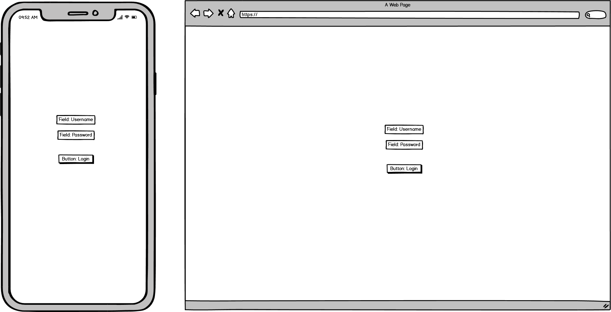
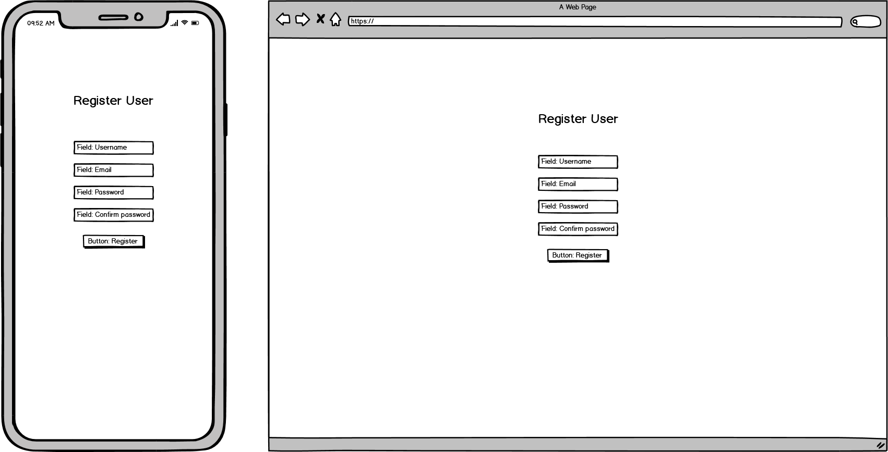
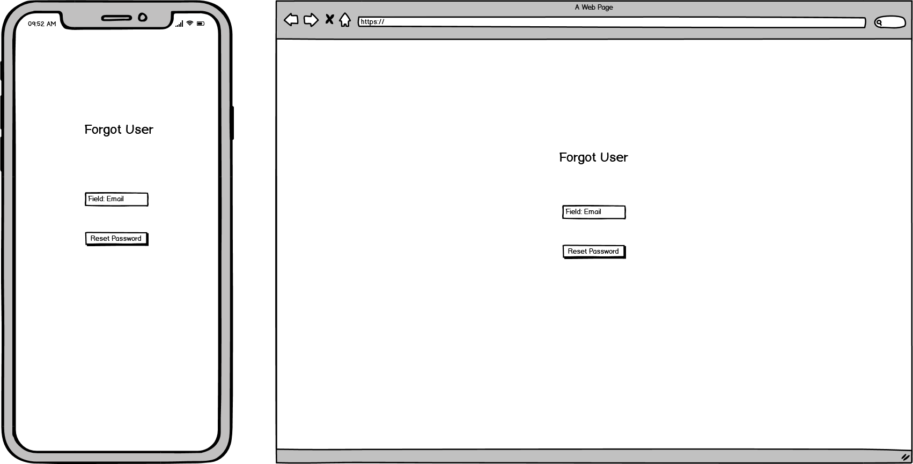
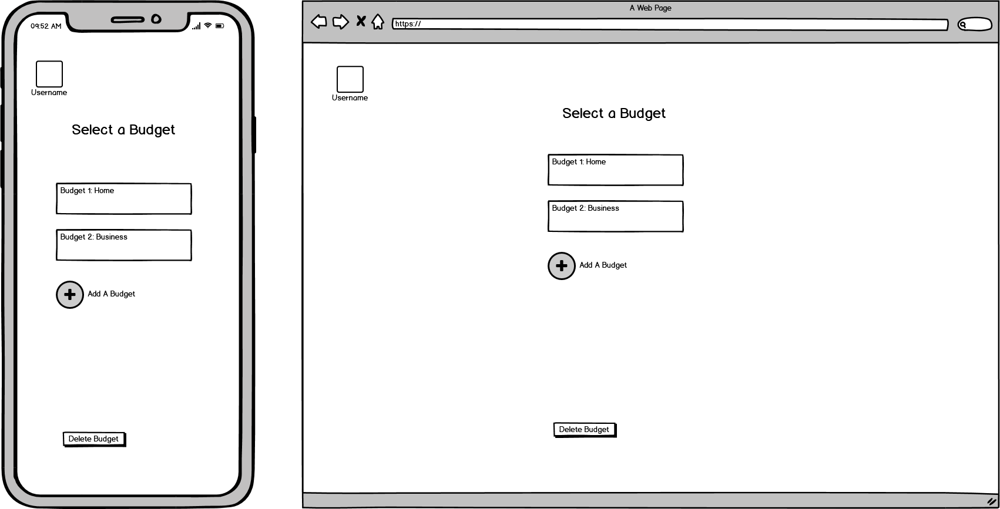
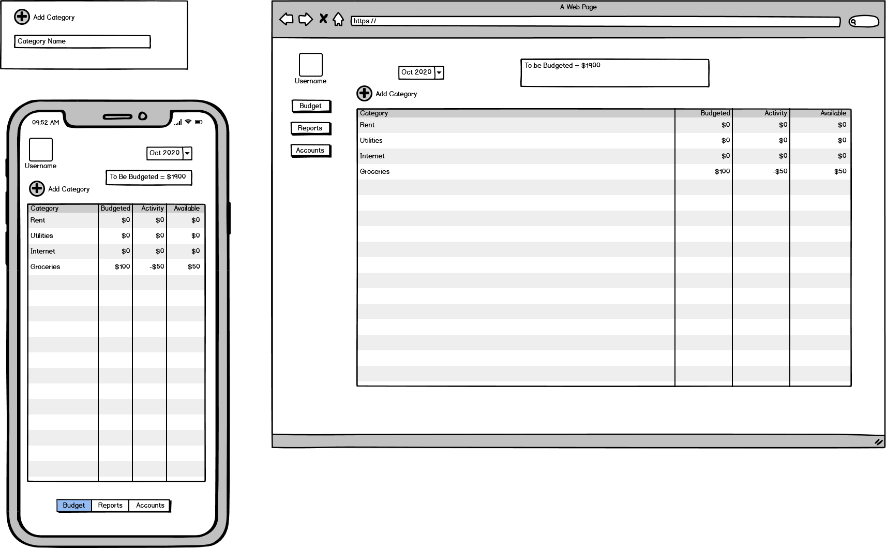
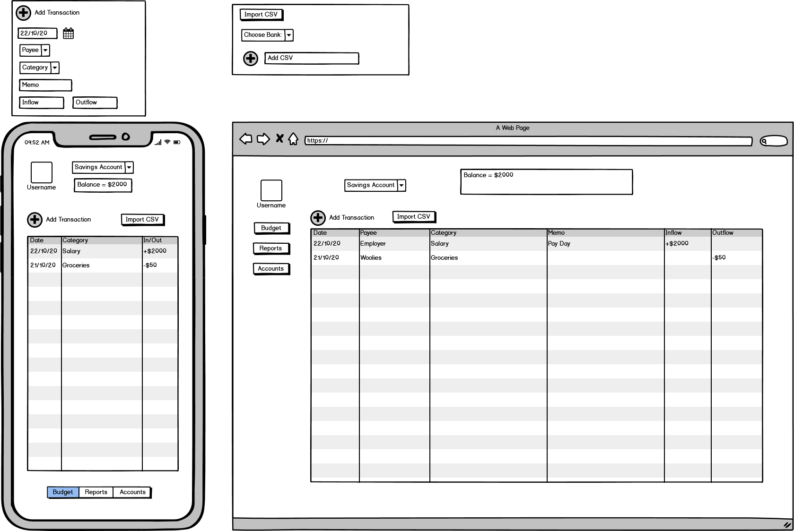
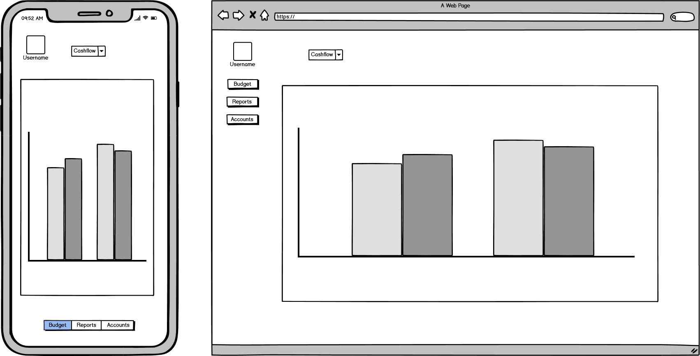
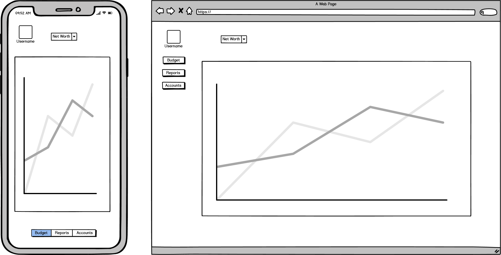
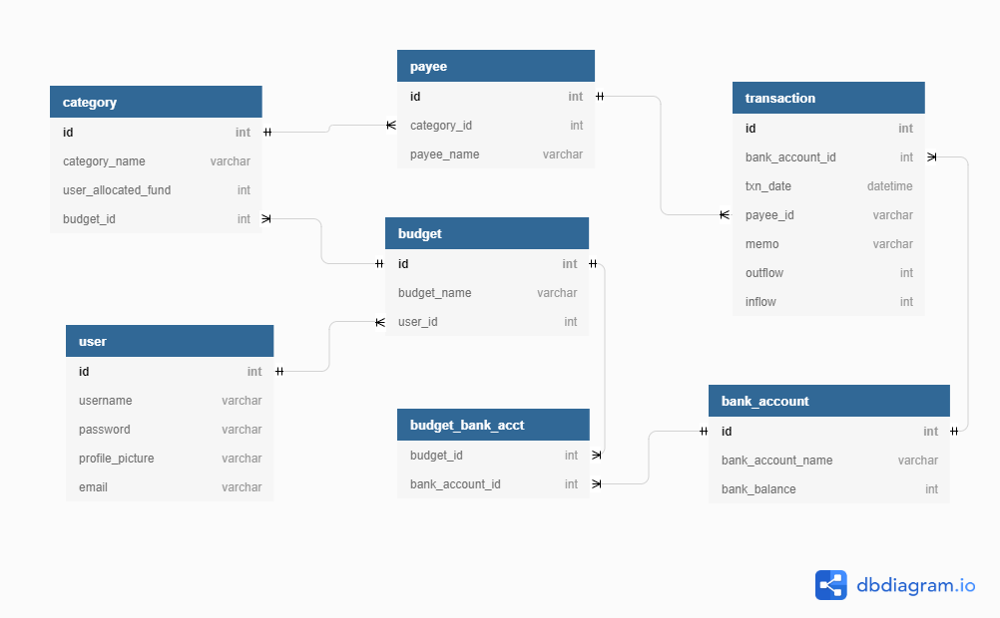

 # Trello

 [Trello Board](https://trello.com/b/Kd6QIMNx/my-money-app)

# Idea

The idea is a budget/money management app. The best way to describe my vision for the app is a lite version of [YNAB](https://www.youneedabudget.com/). My app initially will support csv files imported from the big 4 Aussie banks (Commbank, NAB, Westpac, ANZ)

My app will allow users to:

 - create/login to a personal account
 - create a budget linked to the users account
 - add/remove/edit transactions from a budget
 - filter transactions by date, amount, description
 - import transactions from a csv file to a budget
 - view net worth (graph?)
 - view income/expense

# Installation (Linux)

Install Python and git
```
sudo apt-get update
sudo apt-get install git
sudo apt-get install python3
```

Git clone and Open Folder
```
git clone https://github.com/HarryTranAU/my_money_app.git
cd my_money_app
```

Optional: Virtual Environment (Recommended)

```
sudo apt-get install python3-venv
python3 -m venv venv
source venv/bin/activate
```

Install Pip/requirements
```
sudo apt-get install python3-pip
pip install -r requirements.txt
```

# CI/CD Pipeline

**`Github Actions`**

 - [Setup Python (Github Marketplace)](https://github.com/marketplace/actions/setup-python)
 - Install dependencies
 - Run Tests (`unittest`)
 - Check Data Types (`mypy`)
 - Style Check (`flake8`) 

# Wireframes

## Login Page/Landing Page

1. The Login Page is the users starting point.
2. Login will require an existing username and matching password to continue.
3. Successful login will proceed to the Budget Selection Page.
4. Register New User will proceed to Register User Page.
5. Forgot Password will proceed to Forgot User Page.



## Register User

1. Username and Email must be unique.
2. Successful registration will lead back to Login Page.



## Forgot User

1. A valid existing email is required to reset password.
2. A temporary password will be sent to the provided email.



## User Settings

1. User will be able to add and remove bank accounts from this page.
2. Note: Username is displayed to show which user is currently logged in.
3. The user will be able to change/add a profile picture.


## Budget Selection

1. The Budget Selection screen will be used to select which budget to view.
2. The budget selected will proceed to the Budget Overview page.
3. Budgets can be created and deleted on this page.



## Budget Overview

1. The user's budget will be customized in the budget overview page.
2. The Category column will initialize blank. The user should be able to add and remove 'Categories' and assign a number to the category.
3. 'Budgeted' column can be edited by the user. Numbers Only.
4. 'Activity' column will reflect transactions in that category. User cannot edit this column.
5. 'Available' column will show the difference between the Budget and Activity column. E.g. $100 was budgeted for groceries, $50 was spent on groceries reflected in the transactions, $50 is remaining as 'Available'. User cannot edit this column.



## Accounts Page

1. The Accounts Page will show transactions from the corresponding account(savings, credit, etc).
2. The user will be able to change between accounts from a drop down list or equivalent.
3. A single transaction can be added by manually entering date, payee, category, memo (description), inflow or outflow (Note: a transaction cannot be both an inflow and outflow).
4. The user will have an option to import transactions through a CSV file instead of inputting transactions manually. The bank will need to be select in case the CSV is structured differently for different banks.
5. The balance shown should reflect the current state of the account. Should there be no outstanding transactions to add, the balance should match the user's real (bank) account.
 



## Reports - Cashflow

1. The Cashflow page will show the users income and expense for the different months.
2. The different reporting pages can be navigated through a menu.



## Reports - Net Worth

1. The net worth page will show the user's overall assets and liabilities over a period of time.
2. The different reporting pages can be navigated through a menu.




# Database

1. Each User can have multiple Budgets.
2. Each Budget can have multiple categories. E.g. Rent, Groceries, Utilities, Eating Out, etc.
3. Each Budget can have multiple Bank Accounts. E.g. Savings accounts, Credit Card account, etc.
4. Each Bank Account can have multiple Transactions.
5. Each Transaction can only have one Payee.
6. Each Payee can have multiple transactions. E.g. Multiple trips to Coles. Same Payee different transaction.
7. Each Payee can only belong to one Category. E.g. Coles cannot belong to both Groceries and Eating Out.
8. Each Category can have multiple Payees. E.g. Groceries category can have Coles, Woolworths, IGA, etc.




# OpenAPI

[Interactive UI](https://petstore.swagger.io/?url=https://raw.githubusercontent.com/HarryTranAU/my_money_app/main/docs/swagger.yaml)