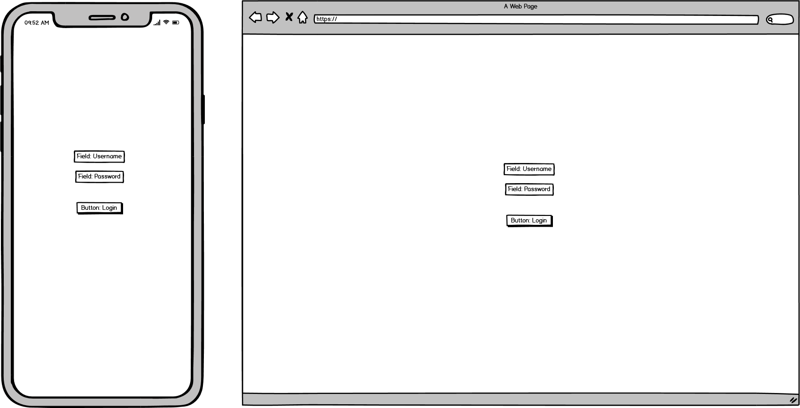
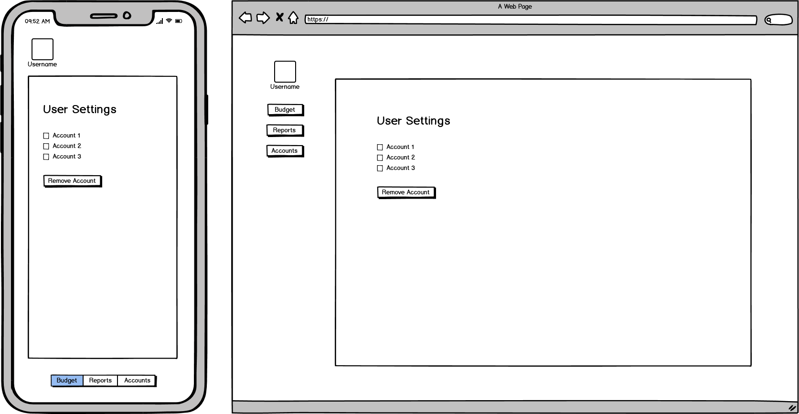
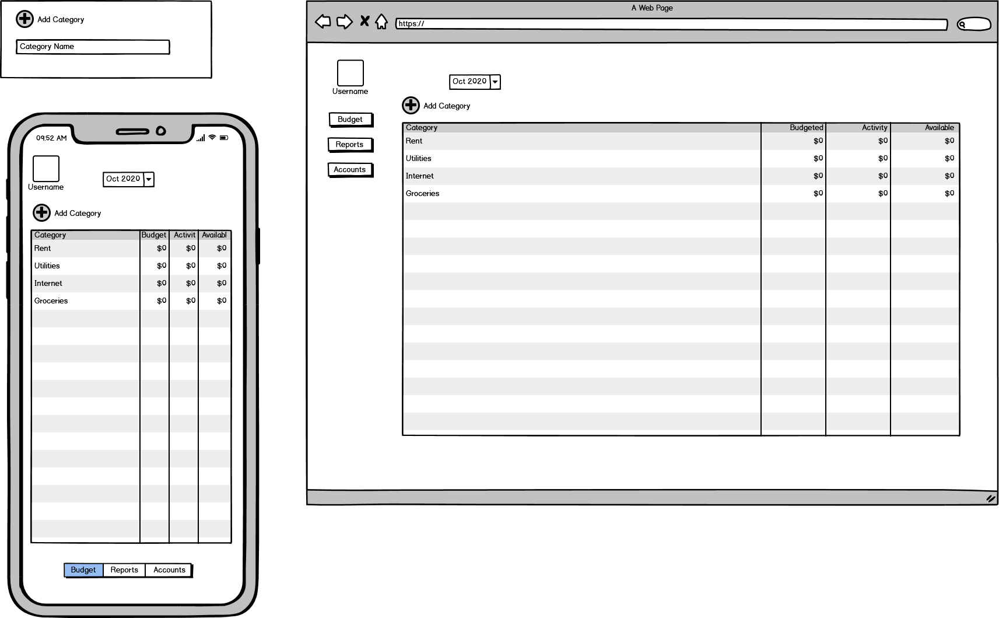
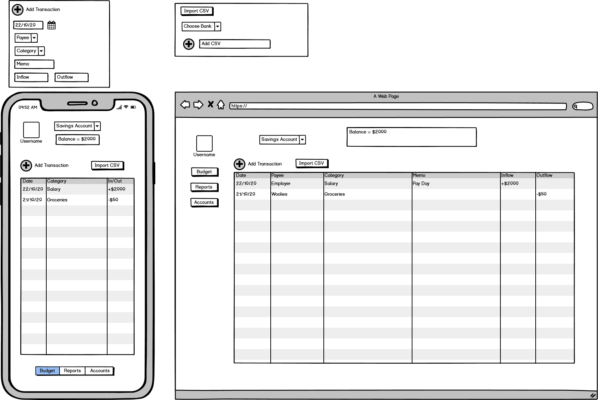
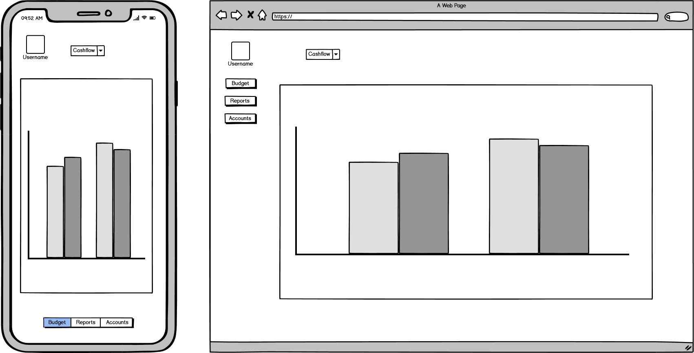
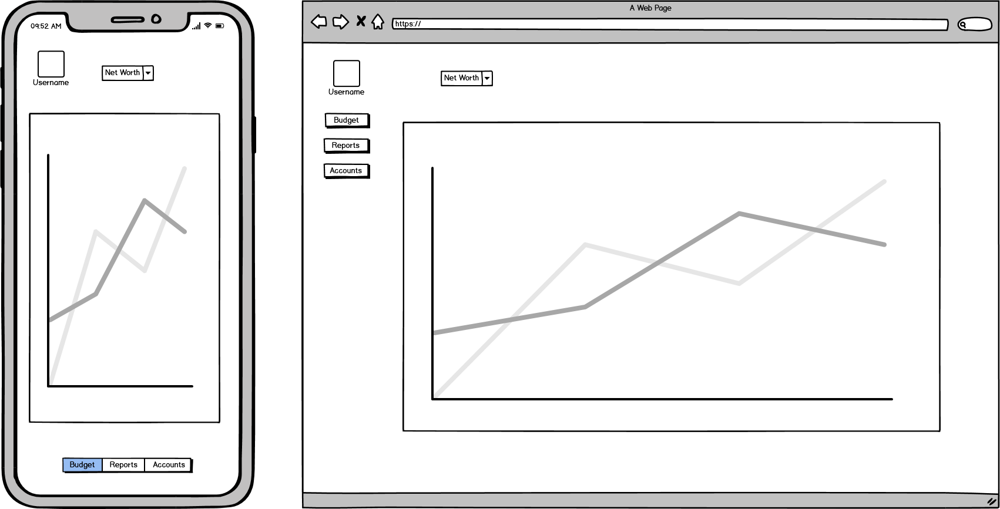

 # Trello

 [Trello Board](https://trello.com/b/Kd6QIMNx/my-money-app)

# Idea

The idea is a budget/money management app. The best way to describe my vision for the app is a lite version of [YNAB](https://www.youneedabudget.com/). My app initially will support csv files imported from the big 4 Aussie banks (Commbank, NAB, Westpac, ANZ)

My app will allow users to:

 - create/login to a personal account
 - create a budget linked to the users account
 - add/remove/edit transactions from a budget
 - filter transactions by date, amount, description
 - import transactions from a csv file to a budget
 - view net worth (graph?)
 - view income/expense

# wireframes

## Login Page/Landing Page

## User Settings

## Budget Page

The Budget page is where the user will be creating their budget. The only editable fields should be the categories and budget columns. Activity column is where the transactions related to the category is summed up and shown. The Available column is the budget column minus the activity column. The user should be able to create and delete a category.

## Accounts Page

## Reports - Cashflow

## Reports - Net Worth

