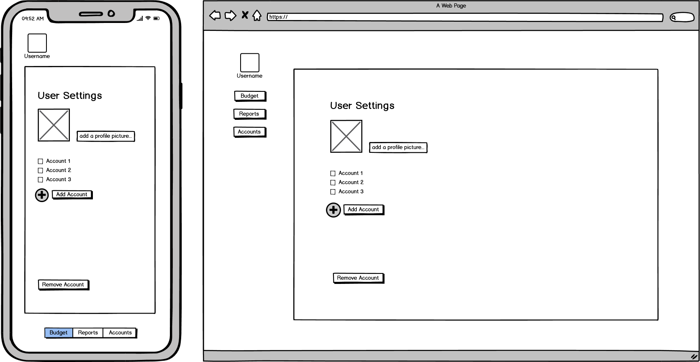

 # Trello

 [Trello Board](https://trello.com/b/Kd6QIMNx/my-money-app)

# Idea

The idea is a budget/money management app. The best way to describe my vision for the app is a lite version of [YNAB](https://www.youneedabudget.com/). My app initially will support csv files imported from the big 4 Aussie banks (Commbank, NAB, Westpac, ANZ)

My app will allow users to:

 - create/login to a personal account
 - create a budget linked to the users account
 - add/remove/edit transactions from a budget
 - filter transactions by date, amount, description
 - import transactions from a csv file to a budget
 - view net worth (graph?)
 - view income/expense

# Installation (Linux)

Install Python and git
```
sudo apt-get update
sudo apt-get install git
sudo apt-get install python3
```

Git clone and Open Folder
```
git clone https://github.com/HarryTranAU/my_money_app.git
cd my_money_app
```

Optional: Virtual Environment (Recommended)

```
sudo apt-get install python3-venv
python3 -m venv venv
source venv/bin/activate
```

Install Pip/requirements
```
sudo apt-get install python3-pip
pip install -r requirements.txt
```

# CI/CD Pipeline

**`Github Actions`**

 - [Setup Python (Github Marketplace)](https://github.com/marketplace/actions/setup-python)
 - Install dependencies
 - Run Tests (`unittest`)
 - Check Data Types (`mypy`)
 - Style Check (`flake8`) 

# Wireframes

## Login Page/Landing Page


## User Settings



## Budget Page

The Budget page is where the user will be creating their budget. The only editable fields should be the categories and budget columns. Activity column is where the transactions related to the category is summed up and shown. The Available column is the budget column minus the activity column. The user should be able to create and delete a category.


## Accounts Page


## Reports - Cashflow


## Reports - Net Worth


